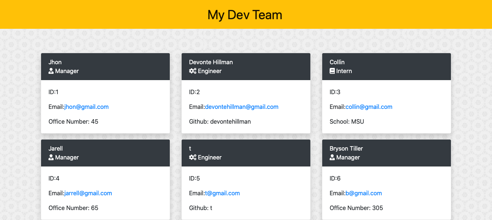

# Team-Profile-Generator

# Description
This is a command line application that takes in information about employees on a software engineering team, generates an HTML webpage and displays summaries for each person. This code incudes unit test for every part of the code and ensure it passes each test.
Table of Contents

# Table of Contents
1. [Description](#Description)
2. [Installation](#Installation)
3. [Usage](#Usage)
4. [lisence](#Lisense)
5. [Tests](#Tests)

## Finished-Page

# Installation
Go to this https://github.com/devontehillman/Team-Profile-Generator and the clone repository. 

# Usage
Open integrated teminal at the Team-Profile-Generator file 
type npm init in the comand line, next type npm install inquirer --save. You must now run npm install jest --save, now run node script in the command line. Choose the type of employee you want to add to your page. After all the employee prompts are asked you will be asked if you want to add another employee, if not the html page will be created, Open in index.html folder in the browser.

# license
To see infomation on the no license click the badge at the top of this README.

# Tests
This repository incudes test. To access them make sure you have run npm insatll jest --save in the terminal. Next you must make sure in your package.json your "scripts" says `"scripts": {"test": "jest"},` Now go to the command line and run npm test and all of the test will be run.

